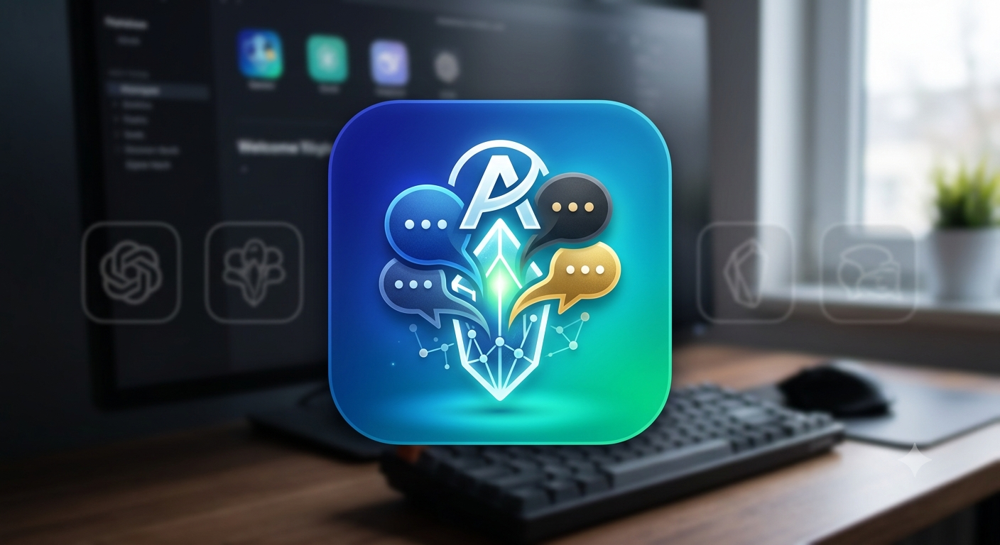

**English** | [Русский](README.ru.md)

# AI Chat Exporter

> *Personal open-source project. Built primarily for my own use and shared publicly in case it is useful to others.*



Desktop application that exports AI chat dialogs (**ChatGPT, Gemini, Claude, Qwen, DeepSeek, Perplexity**) — plus two
user-configurable **Custom 1 / Custom 2** slots — into local Markdown files.
Browser export needs no API keys; Custom API mode can use your own key. No cloud services, no HTTP server.

## Features

- Export dialogs from **ChatGPT, Gemini, Claude, Qwen, DeepSeek, Perplexity**
- **Custom 1 / Custom 2** slots, each in one of two modes:
  - **Web Browser Export** — export any browser chat with user-defined CSS selectors or custom JS
  - **API** — send a prompt to an OpenAI- or Anthropic-compatible endpoint and save the response
- Provider **tabs** with connection-status indicators
- Files saved to `raw/<service>/*.md` — Cyrillic, attachments, metadata supported
- Browser export needs no API keys — works through CDP with a bundled Chromium browser (no system Google Chrome required)
- Selectable output folder; update check; Help/About
- Export all dialogs (**Sync All**) or selected chats; per-provider cancel
- Self-contained installers — Python and Playwright are bundled, nothing to install

## Download

- **[AIChatExporter-Setup-0.8.0.exe](https://github.com/Nordggs/Project_AI_Base/releases)** — installer with Desktop and Start Menu shortcuts (recommended)
- **[AIChatExporter-Portable-0.8.0.zip](https://github.com/Nordggs/Project_AI_Base/releases)** — portable build, no installation required

## Installation

### Option 1 — Installer (recommended)

1. Run `AIChatExporter-Setup-0.8.0.exe`
2. Follow the wizard — Desktop and Start Menu shortcuts are created
3. Launch **AI Chat Exporter**

### Option 2 — Portable

Extract `AIChatExporter-Portable-0.8.0.zip` to any folder and run `AIChatExporter.exe`. Works without installation.

### From source

```bash
pip install -r requirements.txt
playwright install chromium
python main.py
```

For a dev run a system **Google Chrome** is used through CDP; release builds ship their own bundled Chromium.

## Usage

### General mechanism

The app launches a browser (bundled Chromium or system Chrome) with `--remote-debugging-port=9222`.
You sign in to provider accounts in the opened browser window — the session is saved in the profile
(`~/.ai_pipeline/chrome_gemini`), so you don't need to sign in again.

### ChatGPT / Gemini / Claude / Qwen / Perplexity

1. Launch Chrome via the provider card (**🚀 Запустить Chrome**)
2. Sign in to your account in the opened browser window
3. Click **Проверить подключение** (check connection)
4. Click **Синхронизировать** (sync) — the sidebar is scanned and all dialogs are exported

### DeepSeek

1. **Add Account** → paste the chat URL (`https://chat.deepseek.com/a/chat/s/{uuid}`)
2. Sign in to your account in the opened browser window
3. **Sync** — the dialog is exported to `raw/deepseek/`

### Custom 1 / Custom 2

Each slot works in one of two modes (switch the mode in the slot's tab):

**Web Browser Export** — export a chat from any site through the shared CDP browser.
No CSS/DOM knowledge is needed when a preset fits the site:

1. Select **Web Browser Export**
2. Choose a **Preset** and press **Apply preset** (fields fill in, stay editable)
3. Set the chat **URL** (you may change it after Apply — the preset is not locked to one URL)
4. **Test** — check the preset against the live page (chat/message counts + verdict)
5. **Подключить** — connect, then **Сканировать** to list chats
6. **Синхронизировать** — export the selected chats to `raw/`

Manual configuration (for advanced users): if no preset fits, fill in the URL and the CSS selectors
(chat list, title, messages, user/assistant messages), or custom JS, directly in the
*Advanced / Manual configuration* fields.

**API** — send a prompt to an OpenAI- or Anthropic-compatible endpoint:

1. Select **API**
2. Fill in the endpoint, model, protocol, optional API key and system prompt
3. **Test** — verify the connection
4. **Generate & Save** — send a prompt and save the response to `raw/`

> The API key is stored in plain text in the local `config.json`.

## Output format

```markdown
<!-- hash: e7f89a title: chat title chat_order: 0 -->

#### 👤 Вы (2024-01-15 14:30)
user message

#### 🤖 AI
assistant message
```

File name: `{service}_{stable_id[:8]}_{hash6}.md`

## Project structure

```
├── main.py                      # Entry point (pywebview UI + 2 workers)
├── adapters/
│   ├── base.py                  # BaseAdapter ABC
│   ├── cdp_manager.py           # CDPManager (browser lifecycle) + CDPContext
│   ├── chatgpt.py               # ChatGPTAdapter
│   ├── claude.py                # ClaudeAdapter
│   ├── perplexity.py            # PerplexityAdapter
│   ├── qwen.py                  # QwenAdapter
│   ├── gemini.py                # GeminiAdapter
│   ├── deepseek.py              # DeepSeekAdapter
│   ├── custom.py                # CustomAdapter (API mode: send prompt → save)
│   └── custom_web.py            # CustomWebAdapter + SelectorStrategy + ScriptStrategy
├── conversation/
│   ├── models.py                # ConversationModel (core)
│   ├── irbuilder.py             # IRBuilder: adapter → ConversationModel
│   ├── adapters.py              # ChatGPT __NEXT_DATA__ → ConversationModel
│   ├── enrichment.py            # Enricher: CDP assets + runtime + blobs
│   ├── serializer.py            # serialization
│   └── validator.py             # validation
├── exporters/
│   ├── writer.py                # ExportWriter (atomic write, dedup, timestamps)
│   ├── gemini_extract.py        # Gemini DOM extraction
│   ├── chatgpt_extract.py       # ChatGPT DOM extraction
│   ├── claude_extract.py        # Claude DOM extraction
│   ├── perplexity_extract.py    # Perplexity DOM extraction
│   ├── qwen_extract.py          # Qwen DOM extraction
│   ├── deepseek.py              # DeepSeekExporter
│   └── attachment_capture.py    # CDP attachment capture
├── core/
│   ├── logger.py                # LogBuffer (thread-safe)
│   ├── custom_config.py         # Custom slot config (API/Web) load/save
│   └── preset_engine.py         # Preset validation/resolution (validate/filter/path)
├── presets/
│   └── seed_presets.json        # Built-in verified presets (copied to storage on first run)
├── ui/
│   ├── app.html                 # UI layout (tabs + Custom slots)
│   ├── app.js                   # UI logic + pywebview bridge
│   ├── app.css                  # Styles + splash
│   └── icon.ico                 # Window icon
└── raw/                         # Output .md files
```

## Adding a preset (for developers)

- Preset format v1: `{id, name, description, default_url, version, checked_at,
  strategy{type: selector|script, navigation: goto|click,
  wait_after_click_ms (optional, default 2000, must be int > 0),
  selectors{chat_list/message/user/assistant/title/scroll},
  scripts{list_chats_js, extract_messages_js}}}`. Selector presets must not
  carry `*_js` (hybrid is forbidden); script presets require `list_chats_js`.
- Validate with `core/preset_engine.py::validate_preset` → `(True, [])`;
  filter batches with `filter_valid_presets`. Source of truth: the code.
- Proven presets live in `presets/seed_presets.json` (copied next to
  `config.json` as `custom_presets.json` on first `list_presets` call, never
  overwritten). `checked_at` = date of the live verification run; re-check a
  preset with `check_custom_web` (counts + verdict) before changing it.
- Applicability check: `App.check_custom_web(slot, preset_id)` returns
  `{preset_id, page_url, chat_list_N, messages_N, user_N, assistant_N,
  scroll, verdict: Compatible|Partial|Incompatible, reason}`.

## Requirements

- Python 3.10+ (dev run)
- `pywebview>=4.0`
- `playwright>=1.40`
- Google Chrome (dev run only; release builds include bundled Chromium)

## Known limitations

- CDN/blob attachments that cannot be fetched are marked as `partial`; the chat itself is still exported

## License

Distributed under the MIT License — see [LICENSE](LICENSE).
Third-party components (Chromium, Playwright, PyWebView and others) are distributed under their own licenses — see [THIRD_PARTY_NOTICES.md](THIRD_PARTY_NOTICES.md).
